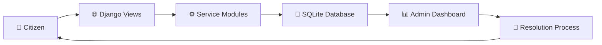

<div align="center">

# 🌆 Smart City Management System


### *Empowering Cities Through Digital Governance*

[Features](#-features) • [Installation](#-installation--setup) • [Usage](#-usage) • [Architecture](#-system-architecture) • [Contributors](#-contributors)

---

</div>

## 📋 Overview

The **Smart City Management System** is a comprehensive digital platform designed to revolutionize urban civic services management. Built with Django, this system bridges the gap between citizens and city administrators, enabling seamless reporting, tracking, and resolution of urban issues.

From infrastructure complaints to emergency reporting, this centralized platform ensures:
- ✅ **Transparency** in issue resolution
- ✅ **Efficiency** in service delivery
- ✅ **Accountability** in governance
- ✅ **Accessibility** for all citizens

---

## ✨ Features

<table>
<tr>
<td width="50%">

### 🎯 Citizen Portal
- 📝 Online complaint registration
- 🔍 Real-time status tracking
- 📍 Location-based issue reporting
- 📱 Responsive mobile interface
- 🔔 Complaint history dashboard

</td>
<td width="50%">

### 🛠️ Admin Dashboard
- 📊 Centralized issue monitoring
- ⚡ Priority-based assignment
- 📈 Analytics and reporting
- 👥 Multi-department coordination
- ✅ Resolution tracking

</td>
</tr>
</table>

---

## 🧩 Modules

| Module | Description | Key Features |
|--------|-------------|--------------|
| 🏛️ **Complaint** | General civic complaints | Registration, tracking, categorization |
| 📊 **Dashboard** | Administrative overview | Analytics, statistics, insights |
| 🛣️ **Road** | Infrastructure issues | Potholes, damaged roads, street lights |
| ⚡ **Electricity** | Power management | Outages, voltage issues, billing |
| 💧 **Water Management** | Water supply services | Supply disruption, quality issues |
| ♻️ **Waste Management** | Waste handling | Collection schedules, disposal |
| 🗑️ **Waste Complaints** | Waste-specific issues | Missed pickups, illegal dumping |
| 🚨 **Emergency** | Urgent reporting | Real-time emergency handling |
| 🗺️ **Mapdata** | Geospatial services | Location-based visualization |

---

## 🏗️ System Architecture



**Flow Overview:**
```
User Registration → Issue Submission → Database Storage → 
Admin Assignment → Resolution Tracking → Status Update → User Notification
```

---

## 💻 Tech Stack

<div align="center">

| Layer | Technology |
|-------|-----------|
| **Backend** | Django 4.x, Python 3.8+ |
| **Database** | SQLite (Production: PostgreSQL/MySQL) |
| **Frontend** | HTML5, CSS3, Bootstrap 5 |
| **Maps** | Leaflet.js / Google Maps API |
| **Utilities** | Pillow, Django REST Framework |

</div>

---

## 📁 Project Structure

```
Smart_City_Management_System/
│
├── 📂 complaint/              # Complaint handling module
│   ├── models.py
│   ├── views.py
│   ├── forms.py
│   └── urls.py
│
├── 📂 dashboard/              # Admin dashboard
├── 📂 electricity/            # Electricity services
├── 📂 emergency/              # Emergency reporting
├── 📂 mapdata/                # Geospatial data
├── 📂 road/                   # Road infrastructure
├── 📂 waste_complaints/       # Waste issues
├── 📂 waste_management/       # Waste services
├── 📂 water_management/       # Water services
│
├── 📂 smart_city/             # Main project config
│   ├── settings.py
│   ├── urls.py
│   └── wsgi.py
│
├── 📂 templates/              # HTML templates
├── 📂 static/                 # CSS, JS, images
├── 📂 media/                  # User uploads
│
├── 🗄️ db.sqlite3             # Database
├── ⚙️ manage.py               # Django management
├── 📋 requirements.txt        # Dependencies
└── 📖 README.md               # Documentation
```

---

## 🚀 Installation & Setup

### Prerequisites
- Python 3.8 or higher
- pip package manager
- Git

### Step-by-Step Guide

#### 1️⃣ Clone the Repository
```bash
git clone https://github.com/Kowshik-bh18/Smart_City_Management_System.git
cd Smart_City_Management_System
```

#### 2️⃣ Create Virtual Environment
**Windows:**
```bash
python -m venv venv
venv\Scripts\activate
```

**Linux/Mac:**
```bash
python3 -m venv venv
source venv/bin/activate
```

#### 3️⃣ Install Dependencies
```bash
pip install -r requirements.txt
```

*If requirements.txt is not available:*
```bash
pip install django pillow djangorestframework
```

#### 4️⃣ Database Setup
```bash
python manage.py makemigrations
python manage.py migrate
```

#### 5️⃣ Create Superuser (Admin)
```bash
python manage.py createsuperuser
```

#### 6️⃣ Collect Static Files
```bash
python manage.py collectstatic
```

#### 7️⃣ Run Development Server
```bash
python manage.py runserver
```

🎉 **Access the application at:** [http://127.0.0.1:8000](http://127.0.0.1:8000)

🔐 **Admin Panel:** [http://127.0.0.1:8000/admin](http://127.0.0.1:8000/admin)

---

## 📖 Usage

### For Citizens
1. **Register/Login** to the portal
2. **Select Module** (Road, Water, Electricity, etc.)
3. **Submit Complaint** with details and location
4. **Track Status** in your dashboard
5. **Receive Updates** on resolution

### For Administrators
1. **Login** to admin dashboard
2. **View** incoming complaints
3. **Assign** to relevant departments
4. **Monitor** resolution progress
5. **Generate** performance reports

---

## 🔮 Future Enhancements

<table>
<tr>
<td>

### 🎯 Phase 1 (Short-term)
- [ ] Role-based authentication (Citizen/Admin/Dept)
- [ ] Email/SMS notifications
- [ ] Advanced search and filters
- [ ] Multi-language support
- [ ] Dark mode UI

</td>
<td>

### 🚀 Phase 2 (Long-term)
- [ ] REST API for mobile apps
- [ ] AI-powered complaint prioritization
- [ ] GIS-based heat maps
- [ ] Chatbot integration
- [ ] Blockchain for transparency

</td>
</tr>
</table>

---

## 🤝 Contributing

We welcome contributions! Here's how you can help:

1. 🍴 Fork the repository
2. 🌿 Create a feature branch (`git checkout -b feature/AmazingFeature`)
3. 💾 Commit changes (`git commit -m 'Add AmazingFeature'`)
4. 📤 Push to branch (`git push origin feature/AmazingFeature`)
5. 🔃 Open a Pull Request

---

## 👥 Contributors

<div align="center">

### Meet the Team Behind Smart City Management

<table>
<tr>
<td align="center" width="33%">
<a href="https://github.com/Kowshik-bh18">

</a>
<br />
<br />
<a href="https://github.com/Kowshik-bh18">
<b>Kowshik BH</b>
</a>
<br />
<sub>Lead Developer & Architect</sub>
<br />
<br />
<code>Backend Development</code>
<br />
<code>System Architecture</code>
<br />
<code>Database Design</code>
<br />
<br />
<a href="https://github.com/Kowshik-bh18">

</a>
</td>
<td align="center" width="33%">
<a href="https://github.com/madhusudhan-31">

</a>
<br />
<br />
<a href="https://github.com/madhusudhan-31">
<b>Madhu Sudhan</b>
</a>
<br />
<sub>Core Developer</sub>
<br />
<br />
<code>Module Development</code>
<br />
<code>API Integration</code>
<br />
<code>Testing & QA</code>
<br />
<br />
<a href="https://github.com/madhusudhan-31">

</a>
</td>
<td align="center" width="33%">
<a href="https://github.com/MDGanesha">

</a>
<br />
<br />
<a href="https://github.com/MDGanesha">
<b>MD Ganesha</b>
</a>
<br />
<sub>Frontend Developer</sub>
<br />
<br />
<code>UI/UX Design</code>
<br />
<code>Frontend Logic</code>
<br />
<code>Responsive Design</code>
<br />
<br />
<a href="https://github.com/MDGanesha">

</a>
</td>
</tr>
</table>

---

### 💡 Contribution Stats

| Contributor | Commits | Lines Added | Lines Removed | Modules Developed |
|-------------|---------|-------------|---------------|-------------------|
| **Kowshik BH** |  | Backend, Dashboard | Database Design | 5+ Modules |
| **Madhu Sudhan** |  | Service Modules | Testing Framework | 4+ Modules |
| **MD Ganesha** |  | Frontend, Templates | Responsive Design | 3+ Modules |

</div>

---

## 📬 Contact

<div align="center">

**Kowshik BH**

[](mailto:kowshikbh18@gmail.com)
[](https://github.com/Kowshik-bh18)
[](https://www.linkedin.com/in/kowshikbh)

</div>

---

## 📄 License

This project is licensed under the MIT License - see the [LICENSE](LICENSE) file for details.

---

## 🌟 Show Your Support

If you find this project useful, please consider:
- ⭐ Starring the repository
- 🍴 Forking for your own use
- 📢 Sharing with others
- 🐛 Reporting bugs
- 💡 Suggesting new features

---

<div align="center">

### Made with ❤️ for Smart Cities

**© 2024 Smart City Management System. All Rights Reserved.**

[Back to Top ⬆️](#-smart-city-management-system)

</div>
